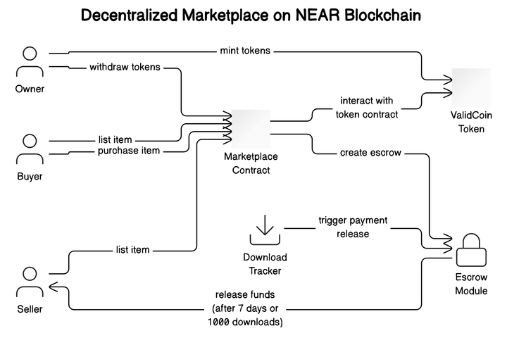
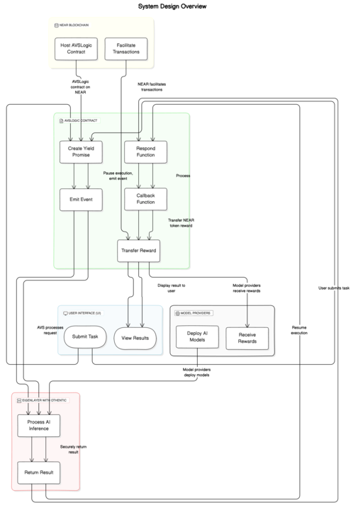

# ValidAI

**Link to video:** https://vimeo.com/1014021314

Introducing a decentralized AI platform powered by EigenLayer AVS and Othentic! Our platform empowers developers with AI agents for automated smart contract auditing and fosters an AI marketplace with subscription-based royalties, incentivizing ML researchers community.

## Current Problems in the AI Industry
1. **Centralization**: AI models are trained on centralized servers, leading to data privacy concerns and a lack of transparency.
2. **High Computation Barrier to Entry**: AI research is expensive and requires specialized hardware, limiting access to a small group of researchers.
3. **Lack of Incentives for Researchers**: Researchers are not rewarded for their work, leading to a lack of innovation and progress in the field.
4. **Difficult collaboration**: It is difficult for researchers to collaborate and share their work with others.

## Description

Our platform leverages a decentralized AI infrastructure built on EigenLayer's restaking mechanism, which taps into Ethereum's security to ensure robust operation for our AI agents. By utilizing Phala Network’s Red Pill contract template, we efficiently deploy AI agents capable of tasks like smart contract auditing and AI-powered code assistance. Developers benefit from automatic smart contract audits and instant, contextually relevant support through a pretrained chatbot and a Retrieval Augmented Generation (RAG) system. Our AI marketplace fosters innovation by providing access to pre-trained models, using a subscription-based royalty system to reward AI/ML researchers. The platform is built on Near Protocol, utilizing its yield resume architecture for high-performance, asynchronous contracts in Rust. This combination of technologies enables secure, scalable, and democratized access to AI.

## Architecture
### Decentralized Marketplace on NEAR Blockchain

This project builds a decentralized marketplace powered by NEAR Protocol and ValidCoin, a custom ERC-20-like token. The platform allows sellers to list items for sale and buyers to purchase them using ValidCoin. Each transaction creates an escrow to ensure security, with funds released automatically after 7 days or upon reaching 1000 downloads. The system incorporates both marketplace and escrow functionalities, ensuring transparent and secure transactions while minimizing gas fees.
### Core Features:

    ValidCoin Token: A capped token used for payments in the marketplace. The owner can mint tokens, while buyers and sellers interact with the token contract for purchases and withdrawals.
    Marketplace Contract: Facilitates item listing and purchasing. Buyers trigger an escrow upon purchasing, which holds funds until the conditions (time or download count) are met for releasing them to sellers.
    Escrow Module: Ensures secure transactions by locking funds until completion conditions are met. Payment is automatically released after 7 days or 1000 downloads. Sellers can also request early release of funds.

### AI-Powered Platform

This platform integrates decentralized AI services built on EigenLayer's restaking and Phala’s Red Pill contract templates. AI agents deployed within the NEAR ecosystem perform complex tasks such as smart contract audits and code assistance.
AI Marketplace Features:

**AI Audits & Code Assistance**: Trained AI agents audit smart contracts and provide on-the-go assistance through an AI-powered chatbot and a Retrieval Augmented Generation (RAG) system.
**Model Marketplace**: A marketplace for pre-trained AI models allows developers to access a wide range of models. Model providers earn royalties through a subscription model for the use of their AI solutions.
**Yield Resume Contracts**: Built using NEAR’s asynchronous architecture, this system processes tasks without polling, offering significant performance benefits.

### Workflow Summary:

**Task Submission**: Users request services like smart contract audits or code assistance.
**AI Processing**: AI agents manage tasks asynchronously, utilizing NEAR’s yield-resume contracts.
**Result Delivery**: Task results are displayed to the user. Model providers receive rewards based on task completions.
**Escrow Mechanism**: For marketplace transactions, buyers create escrows, and payments are released to sellers after meeting specific conditions (7 days or 1000 downloads).

